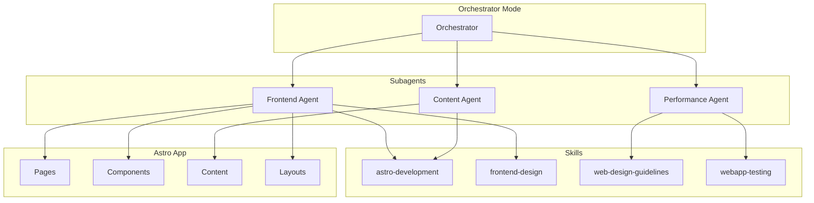
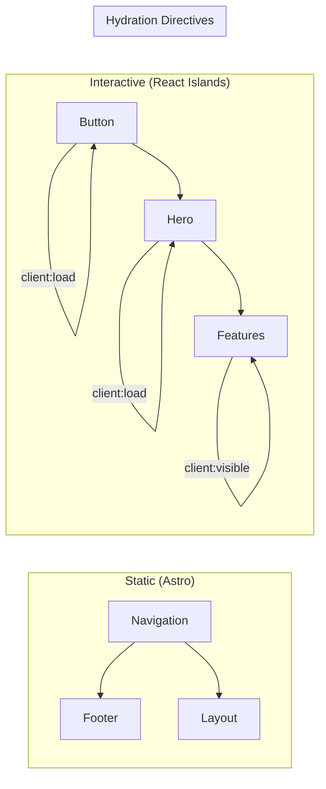
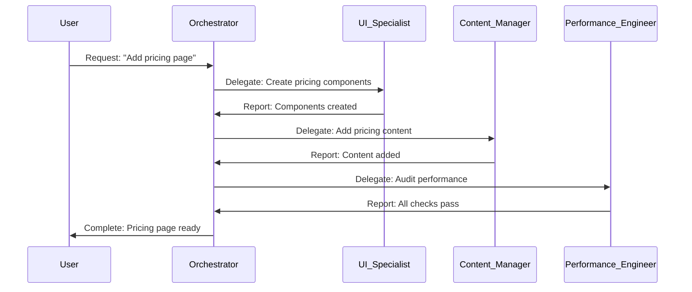

# 📋 Project Plan: Dr-Evoo Astro Landing Page - Full Implementation

## Overview

Build a production-grade Astro landing page for Kilo Code with subagent architecture and specialized skills. The project extends the existing Astro foundation with modern 2026 best practices.

## Project Type

**WEB** (Primary Agent: `frontend-specialist` + Subagents)

---

## Architecture Overview



---

## Current State Analysis

### Existing Foundation ✅

| Component | Status | Details |
|-----------|--------|---------|
| **Framework** | ✅ Astro 5.2.5 | React 19, Tailwind v4 |
| **Hero Component** | ✅ Built | Framer Motion animations |
| **Styling** | ✅ Dark/Brutalist | Custom CSS variables |
| **Structure** | ⚠️ Partial | Only index page + hero |

### Gaps Identified

1. **No View Transitions** - Missing SPA-like navigation
2. **No Content Collections** - Static content only
3. **No Image Optimization** - Missing astro:assets
4. **No Prefetching** - Performance opportunity missed
5. **No Multi-page Structure** - Single page only
6. **No SEO** - Basic meta tags only
7. **No Testing** - No Playwright tests
8. **No Subagent System** - Manual orchestration only

---

## Implementation Plan

### Phase 1: Subagent Configuration (PRIORITY)

#### 1.1 Create Subagent System

**Agent**: `orchestrator`

**Files to Create**:
```
landing-page/
├── .agent/
│   ├── config.yaml           # Subagent definitions
│   ├── prompts/
│   │   ├── ui-specialist.md
│   │   ├── content-manager.md
│   │   └── performance-engineer.md
│   └── skills/
│       └── skill-map.json
```

#### 1.2 Subagent Definitions

**File**: `landing-page/.agent/config.yaml`

```yaml
version: "1.0"
subagents:
  - name: ui-specialist
    role: frontend
    description: Builds React components with Framer Motion animations
    skills:
      - frontend-design
      - vercel-react-best-practices
      - astro-development
    capabilities:
      - react-components
      - animations
      - responsive-design
    filePatterns:
      - "src/components/**/*.tsx"
      - "src/components/**/*.ts"
    delegationRules:
      escalate: ["architecture", "performance"]
      parallelOk: true

  - name: content-manager
    role: content
    description: Manages content collections, MDX, and static data
    skills:
      - astro-development
      - content-research-writer
    capabilities:
      - content-collections
      - mdx
      - schema-validation
    filePatterns:
      - "src/content/**/*"
      - "src/pages/**/*.mdx"
    delegationRules:
      escalate: ["translation"]
      parallelOk: true

  - name: performance-engineer
    role: quality
    description: Optimizes Core Web Vitals and runs tests
    skills:
      - performance-profiling
      - web-design-guidelines
      - webapp-testing
    capabilities:
      - optimization
      - testing
      - auditing
    filePatterns:
      - "src/__tests__/**/*"
      - "**/*.spec.*"
    delegationRules:
      escalate: ["security"]
      parallelOk: false

orchestrator:
  mode: hierarchical
  maxDepth: 2
  qualityGates:
    - lint
    - typecheck
    - test
  escalationPaths:
    - blocking → user
    - architecture → architect
    - security → security-review
```

#### 1.3 Subagent Prompts

**File**: `landing-page/.agent/prompts/ui-specialist.md`

```markdown
# UI Specialist Prompt

## Role
You are a senior frontend developer specializing in React, Framer Motion, and Astro islands architecture.

## Responsibilities
- Build interactive React components with proper hydration directives
- Implement animations that enhance UX without impacting performance
- Ensure responsive design across all breakpoints
- Follow Tailwind CSS v4 best practices

## Key Rules
1. Always use `client:*` directives appropriately:
   - `client:load` - Above-the-fold, immediately needed
   - `client:visible` - Below-fold, lazy load
   - `client:idle` - Non-critical, load when browser idle

2. Minimize JavaScript bundle by:
   - Preferring Astro components for static content
   - Using `client:visible` for off-screen components
   - Avoiding large dependency trees

3. Animation Guidelines:
   - Use Framer Motion for complex animations
   - Prefer CSS transitions for simple state changes
   - Respect `prefers-reduced-motion`

## Quality Standards
- Lighthouse Performance > 90
- No CLS from font loading (use font-display: swap)
- Proper alt text on all images
```

**File**: `landing-page/.agent/prompts/content-manager.md`

```markdown
# Content Manager Prompt

## Role
You are a content architect specializing in Astro Content Collections and type-safe content management.

## Responsibilities
- Define and maintain content collection schemas
- Create MDX content with proper frontmatter
- Validate content against schemas at build time
- Optimize images within content

## Key Rules
1. Always define schemas in `src/content/config.ts` using Zod
2. Use `image()` helper for validating images in collections
3. Prefer static content over dynamic where possible
4. Use `<Image />` component for optimized images

## Quality Standards
- All content validates against schema
- No broken images (use relative paths)
- Proper heading hierarchy (h1 → h2 → h3)
```

**File**: `landing-page/.agent/prompts/performance-engineer.md`

```markdown
# Performance Engineer Prompt

## Role
You are a performance specialist focused on Core Web Vitals and testing.

## Responsibilities
- Optimize LCP, CLS, and INP metrics
- Write and maintain Playwright E2E tests
- Audit accessibility and SEO
- Run Lighthouse audits

## Key Rules
1. LCP Optimization:
   - Preload hero images with `priority` prop
   - Inline critical CSS
   - Use `fetchpriority="high"` on LCP element

2. CLS Prevention:
   - Always set dimensions on images
   - Reserve space for dynamic content
   - Use `font-display: swap` with fallbacks

3. INP Optimization:
   - Minimize islands with `client:visible`
   - Defer non-critical scripts
   - Use `requestIdleCallback` for analytics

## Quality Standards
- Lighthouse Performance ≥ 90
- Lighthouse Accessibility ≥ 90
- Lighthouse SEO ≥ 90
- All Playwright tests pass
```

#### 1.4 Skill Mapping Configuration

**File**: `landing-page/.agent/skills/skill-map.json`

```json
{
  "version": "1.0",
  "subagentSkillMap": {
    "ui-specialist": {
      "primary": ["frontend-design", "vercel-react-best-practices"],
      "secondary": ["astro-development", "web-design-guidelines"]
    },
    "content-manager": {
      "primary": ["astro-development", "content-research-writer"],
      "secondary": ["translation"]
    },
    "performance-engineer": {
      "primary": ["performance-profiling", "webapp-testing"],
      "secondary": ["web-design-guidelines", "security-analysis"]
    }
  },
  "autoActivationRules": {
    "astro-development": {
      "filePatterns": ["**/*.astro", "astro.config.mjs"],
      "alwaysOn": true
    },
    "frontend-design": {
      "filePatterns": ["src/components/**/*.tsx"],
      "alwaysOn": false
    },
    "webapp-testing": {
      "filePatterns": ["**/*.spec.*", "playwright.config.*"],
      "alwaysOn": false
    }
  }
}
```

#### 1.5 Setup View Transitions

**Agent**: `ui-specialist` (after subagent config)

**Implementation**:
```astro
---
import { ClientRouter } from 'astro:transitions';
---
<head>
  <ClientRouter />
</head>
```

**Files to Modify**:
- [`src/layouts/Layout.astro`](landing-page/src/layouts/Layout.astro)

---

### Phase 2: Component System

#### 2.1 Design System Components

**Agent**: `ui-specialist`

| Component | Type | Priority |
|-----------|------|----------|
| Button | React Island | P0 |
| Navigation | Astro | P0 |
| Footer | Astro | P0 |
| FeatureCard | React Island | P1 |
| PricingTable | React Island | P1 |
| TestimonialCarousel | React Island | P2 |
| CodeDemo | React Island | P2 |

#### 2.2 Component Architecture



#### 2.3 Create Component Skeleton

**Agent**: `ui-specialist`

**Files to Create**:
```
src/components/
├── astro/
│   ├── Navigation.astro
│   ├── Footer.astro
│   └── SEO.astro
├── react/
│   ├── Button.tsx
│   ├── FeatureCard.tsx
│   ├── PricingTable.tsx
│   └── Testimonials.tsx
└── ui/
    └── index.ts
```

---

### Phase 3: Content Strategy

#### 3.1 Content Collections Setup

**Agent**: `content-manager`

**Schema Definition**:
```typescript
// src/content/config.ts
import { defineCollection, z } from 'astro:content';

const features = defineCollection({
  type: 'content',
  schema: ({ image }) => z.object({
    title: z.string(),
    description: z.string(),
    icon: z.string(),
    image: image().optional(),
    order: z.number(),
  }),
});

const testimonials = defineCollection({
  type: 'data',
  schema: z.object({
    name: z.string(),
    role: z.string(),
    company: z.string(),
    avatar: z.string(),
    quote: z.string(),
  }),
});

export const collections = { features, testimonials };
```

#### 3.2 Content Files

**Agent**: `content-manager`

**Files to Create**:
```
src/content/
├── features/
│   ├── ai-coding.md
│   ├── multi-provider.md
│   └── open-source.md
└── testimonials/
    └── testimonials.json
```

---

### Phase 4: Page Structure

#### 4.1 Multi-Page Architecture

**Agent**: `ui-specialist`

| Page | Route | Rendering |
|------|-------|-----------|
| Home | `/` | Static |
| Features | `/features` | Static |
| Pricing | `/pricing` | Static |
| Blog | `/blog` | Static (SSG) |
| Docs | `/docs` | Hybrid |

#### 4.2 Page Components

**Files to Create**:
```
src/pages/
├── index.astro          (update existing)
├── features.astro       (new)
├── pricing.astro       (new)
└── blog/
    └── index.astro     (new)
```

---

### Phase 5: Performance Optimization

#### 5.1 Core Web Vitals Strategy

**Agent**: `performance-engineer`

| Metric | Target | Strategy |
|--------|--------|----------|
| LCP | <2.5s | Image priority, inline CSS |
| CLS | <0.1 | Dimension reserves |
| INP | <200ms | Minimal islands, deferred JS |
| FID | <100ms | Lazy hydration |

#### 5.2 Optimization Techniques

**Implementation**:
1. **Image Optimization**:
   ```astro
   <Image src={heroImage} priority alt="Hero" />
   ```

2. **Prefetching**:
   ```astro
   <a href="/features" data-astro-prefetch="viewport">
   ```

3. **Font Optimization**:
   ```astro
   <link rel="preload" href="/fonts.woff2" as="font" type="font/woff2" crossorigin>
   ```

---

### Phase 6: Testing & Quality

#### 6.1 Test Strategy

**Agent**: `performance-engineer`

| Test Type | Tool | Coverage |
|-----------|------|----------|
| E2E | Playwright | Critical flows |
| Unit | Vitest | Components |
| Visual | Percy | UI regression |
| Performance | Lighthouse | Core Web Vitals |

#### 6.2 Test Files

**Files to Create**:
```
src/__tests__/
├── landing.spec.ts
├── components/
│   ├── Button.spec.tsx
│   └── Hero.spec.tsx
└── e2e/
    └── navigation.spec.ts
```

---

### Phase 7: Deployment Configuration

#### 7.1 Build Configuration

**Agent**: `frontend-specialist`

**Updates to [`astro.config.mjs`](landing-page/astro.config.mjs)**:
```javascript
export default defineConfig({
  site: 'https://kilocode.ai',
  integrations: [
    react(),
    tailwindcss(),
  ],
  prefetch: {
    prefetchAll: true,
    defaultStrategy: 'viewport',
  },
  image: {
    service: { entrypoint: 'astro/assets/services/sharp' },
  },
});
```

#### 7.2 Environment Variables

**Files to Create**:
```
.env
├── PUBLIC_SITE_URL=https://kilocode.ai
├── PUBLIC_ANALYTICS_ID=GA-XXXXX
```

---

## Subagent Workflow Definition

### Orchestrator Mode Configuration

**File**: `landing-page/.agent/orchestrator.md`

```markdown
# Landing Page Orchestrator

## Delegation Rules

1. **Hero & Landing Components** → `ui-specialist`
   - React + Framer Motion
   - client:load directive

2. **Content & Collections** → `content-manager`
   - MDX content
   - JSON data

3. **Performance & Testing** → `performance-engineer`
   - Core Web Vitals
   - Playwright tests

## Communication Protocol

- Subagents report to orchestrator
- Blocking issues escalate to user
- Non-blocking suggestions logged

## Quality Gates

- [ ] Lint passes
- [ ] TypeScript strict
- [ ] Lighthouse >90
- [ ] Playwright tests pass
```

---

## Skill Integration

### Required Skills (2026 Best Practices)

| Skill | Purpose | Usage |
|-------|---------|-------|
| [`astro-development`](.kilocode/skills/astro-development/SKILL.md) | Framework best practices | All Astro files |
| [`frontend-design`](.kilocode/skills/frontend-design/SKILL.md) | UI/UX excellence | React components |
| [`web-design-guidelines`](.kilocode/skills/web-design-guidelines/SKILL.md) | Accessibility/SEO | All pages |
| [`webapp-testing`](.kilocode/skills/webapp-testing/SKILL.md) | Playwright E2E | Test implementation |

### Skill Configuration

**File**: `landing-page/.kilocode/config.json`

```json
{
  "skills": {
    "astro-development": {
      "enabled": true,
      "autoActivate": true
    },
    "frontend-design": {
      "enabled": true,
      "autoActivate": false
    },
    "web-design-guidelines": {
      "enabled": true,
      "autoActivate": true
    },
    "webapp-testing": {
      "enabled": true,
      "autoActivate": false
    }
  }
}
```

---

## Success Criteria

| Criterion | Target | Measurement |
|-----------|--------|-------------|
| **Performance** | Lighthouse >90 | CI/CD pipeline |
| **Accessibility** | WCAG 2.1 AA | Lighthouse audit |
| **SEO** | 100/100 | PageSpeed Insights |
| **Test Coverage** | >80% | Vitest + Playwright |
| **Build Success** | Zero errors | CI/CD pipeline |

---

## Execution Order (Subagent-First)

```
PHASE 1: SUBAGENT CONFIGURATION (PRIORITY)
├── 1.1 Create .agent/ directory structure
├── 1.2 Write config.yaml with 3 subagents
├── 1.3 Write subagent prompts (ui-specialist, content-manager, performance-engineer)
├── 1.4 Write skill-map.json
└── 1.5 Setup View Transitions in Layout

PHASE 2: Component System
├── 2.1 Design system components (via ui-specialist)
├── 2.2 React islands (via ui-specialist)
└── 2.3 Navigation + Footer (via ui-specialist)

PHASE 3: Content Strategy
├── 3.1 Content collections (via content-manager)
├── 3.2 Features content (via content-manager)
└── 3.3 Testimonials data (via content-manager)

PHASE 4: Page Structure
├── 4.1 Multi-page routing
├── 4.2 Features page
└── 4.3 Pricing page

PHASE 5: Performance
├── 5.1 Image optimization (via performance-engineer)
├── 5.2 Prefetching (via performance-engineer)
└── 5.3 Font optimization (via performance-engineer)

PHASE 6: Testing
├── 6.1 Unit tests (via performance-engineer)
├── 6.2 E2E tests (via performance-engineer)
└── 6.3 Visual regression (via performance-engineer)

PHASE 7: Deployment
├── 7.1 Build config
├── 7.2 Environment vars
└── 7.3 CI/CD pipeline
```

### Subagent Delegation Workflow



### Quality Gates per Subagent

| Subagent | Quality Gate | Tool |
|----------|-------------|------|
| UI Specialist | Lint + TypeCheck | ESLint + tsc |
| Content Manager | Schema Validation | astro check |
| Performance Engineer | Lighthouse + Tests | Playwright + Lighthouse CI |

---

## Related Plans

- [`PLAN-landing-page.md`](PLAN-landing-page.md) - Original landing page plan
- [`PLAN-research.md`](PLAN-research.md) - Research integration

---

*Plan created: 2026-03-22*
*Last updated: 2026-03-22*
